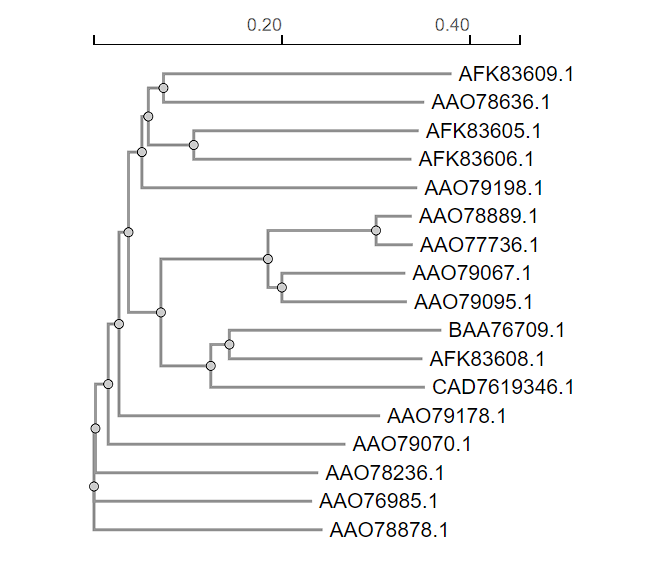

# Fylogenetická analýza rodiny glykosidhydroláz GH92

Tento repozitář obsahuje zápočtový úkol z předmětu "Základy bioinformatiky". Projekt je zaměřen na evoluční analýzu a srovnání enzymů ze strukturní rodiny **GH92** (především $lpha$-mannosidázy) z různých mikroorganismů.

## Cíle projektu
* Vyhledání a stažení sekvencí enzymů rodiny GH92 z databází (UniProt, ENA).
* Provedení vícenásobného sekvenčního zarovnání (MSA).
* Identifikace konzervovaných oblastí a strukturních odlišností.
* Konstrukce a vizualizace fylogenetického stromu pro posouzení evoluční příbuznosti.

## Analyzované organismy a enzymy
Rodina GH92 obsahuje $Ca^{2+}$-dependentní $lpha$-mannosidázy s charakteristickou dvoudoménovou strukturou, které produkují $eta$-mannózu. Pro analýzu bylo vybráno **17 sekvencí** (včetně $lpha$-1,2-mannosidáz, $lpha$-1,3-mannosidáz, $lpha$-1,4-mannosidáz a dalších) z následujících organismů:
* *Bacteroides thetaiotaomicron*
* *Cellulosimicrobium cellulans*
* *Microbacterium sp.*
* *Neobacillus novalis*

## Použité bioinformatické nástroje
* **UniProt / ENA:** Vyhledávání a zisk sekvencí ve FASTA formátu.
* **Clustal Omega:** Vícenásobné sekvenční zarovnání.
* **ESPript 3.0:** Vizualizace zarovnání a konzervovaných domén.
* **Simple Phylogeny:** Tvorba fylogenetického stromu.

## Výstupy a závěry
Ze zarovnání (MSA) vyplynulo, že sekvence sdílejí vysokou míru konzervovanosti v kratších úsecích (zejména ve střední části proteinů odpovídající pravděpodobně aktivnímu místu), ale celkově se výrazně liší svojí délkou. Fylogenetický strom následně vizualizuje shlukování těchto sekvencí podle jejich funkční a druhové příbuznosti.

### Fylogenetický strom

## Obsah repozitáře
* `bioinformatika_ukol_Sustrova.pdf` - Kompletní vypracovaný úkol obsahující detailní vícenásobné zarovnání a vizualizovaný fylogenetický strom.
* `fylogeneticky_strom.png` - Vyexportovaný obrázek fylogenetického stromu.
* `espript_zarovnani.pdf` - Kompletní, barevně obarvené vícenásobné sekvenční zarovnání z nástroje ESPript 3.0.
* `clustalo-I20240329-191856-0020-60580909-p1m-aln-clustal_num.txt` - Surový textový výstup zarovnání z programu Clustal Omega.
* `fasta_sekvence/` - Složka obsahující původních 17 nestrukturovaných FASTA souborů stažených z UniProt/ENA.
